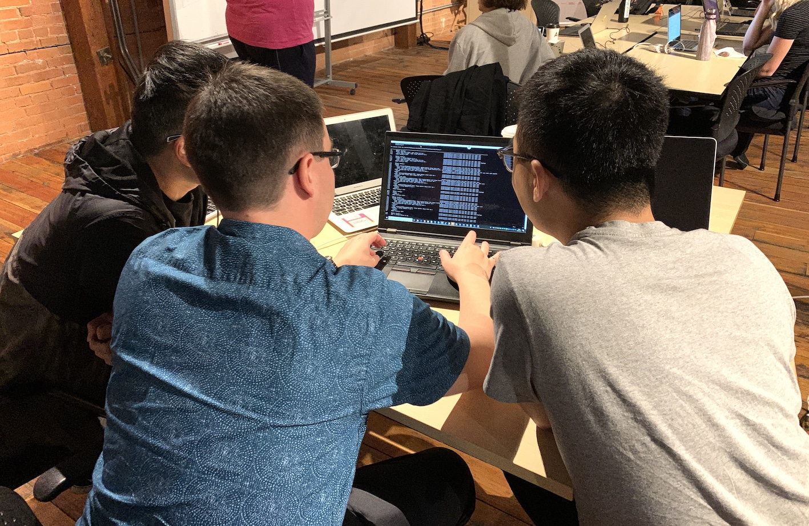

Industry mentors work with CANOSP students on various open-source projects
over the course of a semester. At the beginning of the term, students get to
rank the projects that they would like to work on and assigned to groups based
on their preferences. Here are some project proposals that CANOSP students got to
choose from:

## Current projects



<h3><a href="{{ post.url }}">{{ post.title }}</a></h3>

{{ post.excerpt }}
<a href="{{ post.url }}">Read more...</a>

{{ post.content }}




---

## Past projects



<h3><a href="{{ post.url }}">{{ post.title }}</a></h3>

{{ post.excerpt }}
<a href="{{ post.url }}">Read more...</a>

{{ post.content }}



